## Distributed Database

### 시나리오

#### 작은 규모의 어플리케이션 시작
-  단일 데이터베이스를 사용하여 유저 가 사용할 데이터를 생성, 조회, 수정, 삭제 등의 기능을 제공한다.

#### 서비스 활성화 및 데이터 증가
-  서비스가 활성화되면서 데이터가 많아지고, 단일 데이터베이스로 처리하기 어려워진다.
-  저장해야 할 데이터와 트래픽이 증가하여 성능에 부담이 생기게 되는데, 이를 해결하기 위해 **데이터베이스를 분산** 시킬 필요가 있다.

#### Scale-up vs Scale-out 을 고려할 수 있다.
-  **Scale-up**: 하드웨어를 업그레이드하여 성능을 향상시키는 방법이다. 그러나 매번 업그레이드 하기엔 한계가 있으며 비용이 많이 든다.
-  **Scale-out**: 데이터베이스를 여러 노드에 분산시켜 확장하는 방법이다. 수평적으로 확장 가능하며 비용 효율적인 장점 이 잇다.

#### Scale-out 으로 데이터베이스 분산 결정 !
-  **Scale-out**을 선택하고, 데이터베이스를 여러 노드에 분산 시킨다.
-  데이터를 복제하여 고가용성을 제공한다.

---
## 그런데, 데이터는 각 데이터베이스에 어떻게 분산 될 수 있을까 ?
- 샤딩을 이용해 데이터를 여러 DB 에 분산할 수 있다.
- 그리고 샤딩된 각각의 데이터 단위를 샤드라고 한다.

### 샤딩 과 샤드 란
-  **샤딩 ( Sharding )** : 데이터를 여러 데이터베이스에 분산하여 저장하는 기술이다.
-  **샤드 ( Shard )** : 분산된 데이터베이스의 각 부분을 의미한다. ( 샤딩된 각각의 데이터 단위 )

> 추가적으로 복제 에 대해서도 알아두자.   
> **복제 ( Replication )** : 데이터를 여러 노드에 복제하여 고가용성을 제공하는 기술이다.

## 수직 샤딩 (Vertical Sharding)
-  **설명**: 데이터를 열 단위로 분산하여 저장
-  **장점**: 성능 및 공간 이점
-  **단점**: Join이나 트랜잭션 관리가 복잡해질 수 있으며, 수평적 확장에 제한이 있다.

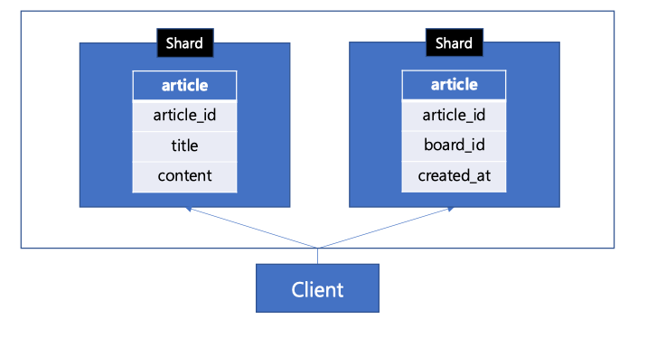

> 각 샤드가 적은 수의 컬럼을 저장하므로, 성능 및 공간 이점이 생긴다.   
> 하지만, 데이터의 분리로 인해 Join 또는 트랜잭션 관리가 복잡해질 수 있다.   
> 수직으로 분할되므로 수평적 확장에 제한이 있다.   
> 위 예시에서는 컬럼 단위로 분할되었기 때문에, 컬럼 수 만큼만 확장 가능한가? 라는 의문이 들 수 있다.  

## 수평 샤딩 (Horizontal Sharding)
-  **설명**: 데이터를 행 단위로 분산하여 저장
-  **장점**: 성능 및 공간 이점이 있으며, 수평적으로 확장하기 용이
-  **단점**: 데이터 분리로 인해 Join이나 트랜잭션 관리가 복잡해질 수 있다

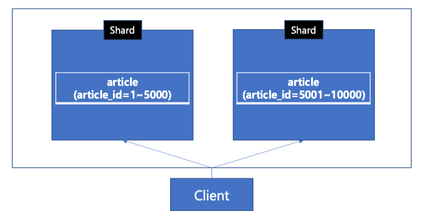

> 각 샤드에 데이터가 분산 저장되므로 성능 및 공간 이점이 생긴다.  
> 하지만, 데이터의 분리로 인해 역시, Join 또는 트랜잭션 관리가 복잡해질 수 있다.   
> 수평으로 분할되므로 수평적 확장에 용이하다.  

---
## 구체적인 샤딩 기법이 필요해
- 샤딩 기법엔 여러가지가 존재한다

### 1. Range-based Sharding ( 범위 기반 샤딩)
- **설명**: 데이터의 범위를 기준으로 샤드를 나누는 방식
- **장점**: 데이터의 범위를 기준으로 샤드를 나누기 때문에, 데이터의 분포가 균일하게 나눠질 수 있다.
- **단점**: 범위가 불규칙하거나, 데이터의 분포가 균일하지 않을 경우, 샤드의 부하가 불균형해질 수 있다. ( 데이터 쏠림 현상 )

### 2. Hash-based Sharding ( 해시 기반 샤딩)
- **설명**: 데이터의 해시값을 기준으로 샤드를 나누는 방식
- **장점**: 데이터의 해시값을 기준으로 샤드를 나누기 때문에, 데이터의 분포가 균일하게 나눠질 수 있다.
- **단점**: 해시 충돌이 발생할 경우 (게시글 id 가 shard Key 라고 가정할때), 인기 많은 게시글에 데이터가 몰릴 수 있음 ( 역시 데이터 쏠림 현상 )

> 범위 데이터 조회에 불리할 수 있다.   
> 게시글 id 가 shard Key 인 상황에 게시글 목록 조회하려면 ?   
> 게시글 id를 기준으로 데이터가 분산되었기 때문에, 모든 샤드를 조회할 수도 있다.   
> 시스템 특성에 따라서, 적절한 Shard Key 와 해시 함수를 선정해야 한다.

### 3. Directory-based Sharding ( 디렉토리 기반 샤딩)
- **설명**: 데이터의 위치 정보를 디렉토리에 저장하고, 디렉토리를 통해 데이터를 조회하는 방식
- **장점**: 데이터 규모에 따라 유연한 관리가 가능하다.
- **단점**: 디렉토리에 대한 추가적인 관리가 필요하며, 디렉토리에 대한 별도의 부하가 발생할 수 있다.

> 이 외에도 다양한 샤딩 기법이 존재하고, 시스템의 특성에 따라 적절한 기법을 선택해야 한다.  
> 그렇지만, 핵심은 같다고 본다.  
> 샤딩을 통해 데이터를 분산하고, 복제를 통해 고가용성을 제공하는 것이 중요하다.

---
## 데이터베이스의 확장성과 연관된 개념인 물리적 샤드와 논리적 샤드의 개념

### **물리적 샤드 ( Physical Shard )**: 실제 데이터베이스 서버에 저장된 데이터의 물리적인 단위

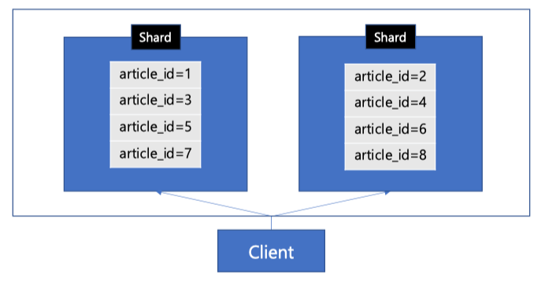

> 물리적 샤드가 2개인 위 상황에서 hash-based sharding 을 적용하면, 데이터는 두 샤드에 분산 저장된다.   
> 
> 2개의 샤드에 균등한 분산을 위해 아래와 같은 해시 함수를 적용한다.  
( **hash function = article_id -> article_id % 2** )  
> 
> 이제 8 개의 데이터는 2개의 샤드에 4새씩 균등하게 분산되었다.

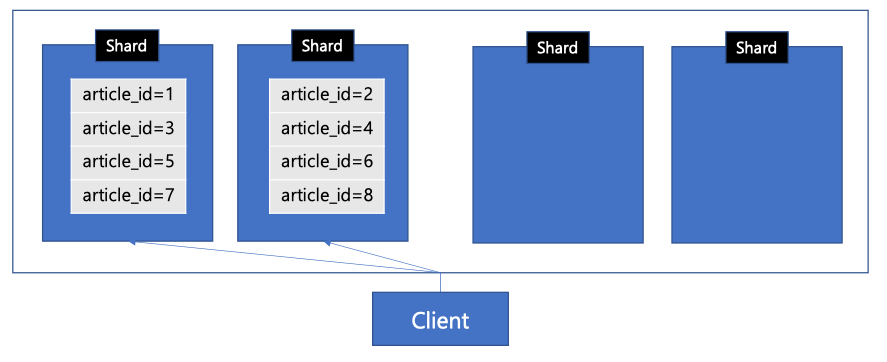
> 갹 샤드가 더이상 데이터를 감당할 수 없어서, 샤드를 들려야 하는 상황이 왔다.  
> 물리적 샤드를 4개로 늘려보자.

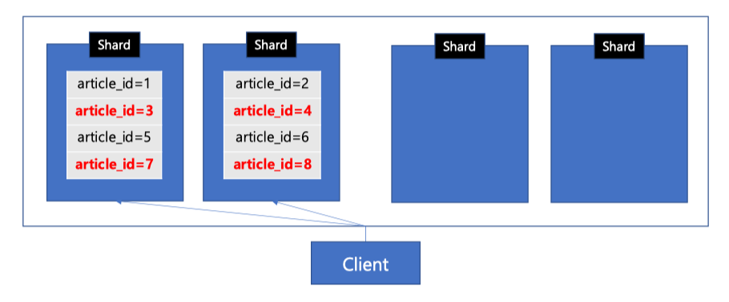
> 늘어난 4개의 샤드에 균등한 분산을 위해 아래와 같은 해시 함수를 적용해야 한다.  
> ( **hash function = article_id -> article_id % 4** )  
>
> article_id = 3, 7, 4, 8 은 데이터 재배치가 필요하다.  

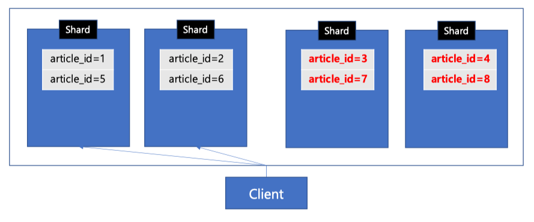
> Client 는 이제 4개의 Shard 로 요청해야 하므로, 애플리케이션의 코드를 수정하는 등의 새로운 shard 의 정보를 알아야 한다.

---
### 데이터베이스 확장 (변경) 으로 인해 client 수정도 필요하네 ..
> client 와 데이터베이스는 독립적으로 구성 및 운영될 수 있는 시스템이다.  
> Client 수정 없이 DB 만 유연하게 확장하는 방법은 없을까 ?  

## 대안은 논리적 샤드

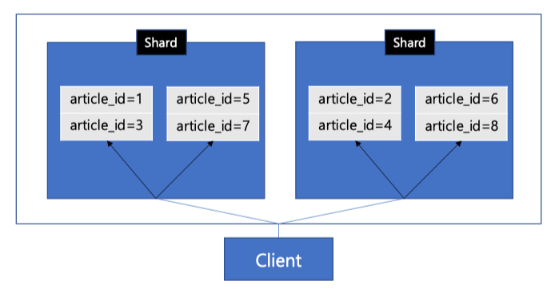
> 이번에는 물리적인 샤드의 개수와 관계없이, 개념적으로 데이터를 분할하는 가상의 샤드가 4개 있다고 가정해보자.  
> 이러한 가상의 샤드를 논리적 샤드라고 한다.  
> 
> 물리적으로는 2개의 샤드로 분산되지만, Client 는 4개의 샤드로 분산된 것으로 인지하다.
> Client 는 논리적 샤드의 접근 방법으로만 DB 에 연결하는 것이다.
> 
> **hash_function = article_id -> article_id % 4**  
> 
> 그러면, Client 가 요청한 논리적 샤드가 어떤 물리적 샤드에 속해있는지 알아야한다.  
> 
> 그래야 직접적으로 데이터에 접근할 수 있다.  
> 
> 이러한 라우팅을 위한 라우터는, DB 시스템 내부 또는 DB 와 Client 를 연결해주는 중간 부분에 독집적으로 만들어 질 수 있다.

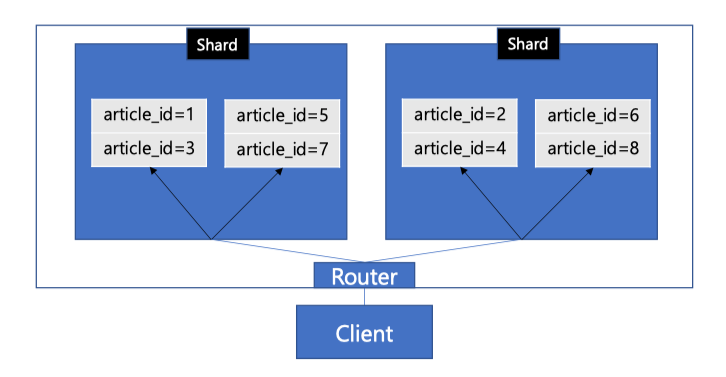
> Client 는 논리적 샤드를 기반으로 Router 에 요청하면, DB 시스템 내부의 Router 는 물리적으로 샤드를 라우팅 해준다.  
> 
> 예를 들어, article_id = 5 데이터를 요청하려면   
> client 입장에서 4개의 논리적 샤드가 있으므로 5 % 4 = 1 번 샤드로 Router 에 요청한다.  
> 
> Router 는 1번 논리적 샤드에 대한 요청을 받아서, 좌측 물리적 샤드로 라우팅 한다.  

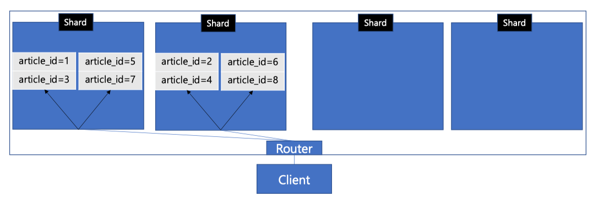
> 4개의 물리적 샤드로 늘려보아도 논리적으로 4개의 샤드로 분산되어 있지만,  
> 
> 물리적 샤드가 늘어남에 따라서 데이터를 물리적으로 다시 재배치할 수 있다.  

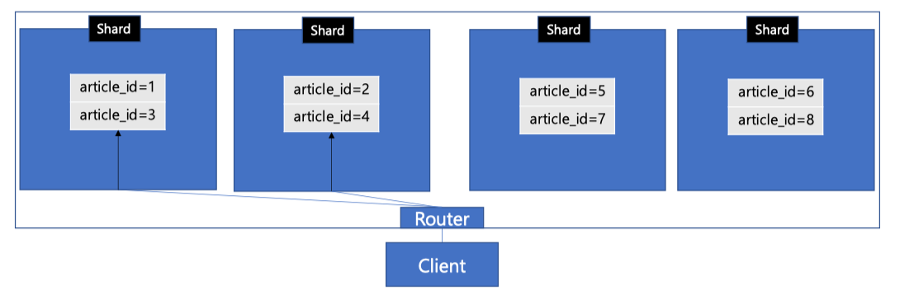
> 4개의 물리적 샤드로 데이터가 재배치되었다.  

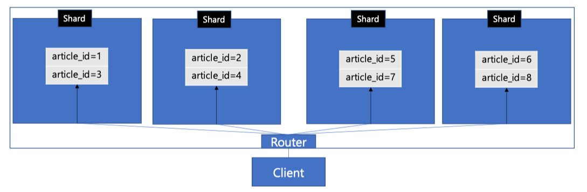
> Router가 물리적으로 늘어난 새로운 샤드 정보를 알도록 한다.   
> 이번에는 Client는 어떠한 수정도 필요 없었다.   
> 
> 새로운 물리적 샤드를 알 책임이 있는 Router 는 DB 시스템 내부에 있었기 때문이다.  
> 
> 즉, 논리적 샤드 개념을 이용하여, 물리적 샤드를 확장하더라도, Client 는 어떠한 변경 없이 DB 를 유연하게 확장할 수 있었던 것이다.  

| 구분   | 물리적 샤드                                     | 논리적 샤드                                      |
|--------|------------------------------------------------|-------------------------------------------------|
| 정의   | 데이터를 물리적으로 분산한 실제 단위            | 데이터를 논리적으로 분산한 가상의 단위            |
| 필요성 | 대규모 데이터 분산 저장 및 성능 향상            | 물리적 확장 시, Client 변경 없이 유연한 매핑 가능 |

### 추가 학습 거리
- Quorum, Split Brain, Multi-Leader, Collision, Consensus, Clock
- 하지만 이러한 특성들을 알아두어야 시스템을 구성하고 문제 발생 시에 대처할 수 있을 것
- 물론, 실제로 개발자가 이러한 운영 환경을 밑바닥부터 모두 직접 구축할 일은 잘 없을 것
- 일단 개념을 이해하고, 클라우드 기반 솔루션 또는 오픈소스도 많으니 잘 활용해보자

