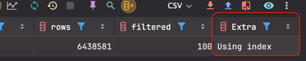
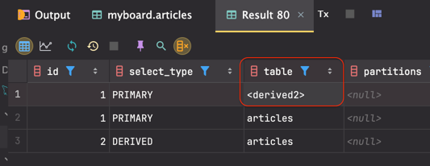
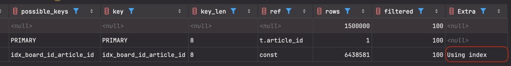

## 인덱스에 대한 이해
- MySQL 의 기본 스토리지 엔진
  - InnoDB
- 스토리지 엔진 (Storage Engine) : DB 에서 데이터 저장 및 관리 장치
  - 그리고 InnoDB 는 테이블마다 Clustered Index 를 가지고 있다.
  - Primary Key 를 기준으로 정렬된 Clustered Index
  - Primary Index (주 인덱스) 라고도 불린다.
  - 정확히는 규칙이 있지만, 일반적으로 Primary Key 에 생성된다.
  - Clustered Index 는 leaf node 의 값으로 행 데이터 (row Data) 를 가진다.

- 개발자가 추가적으로 생성한 인덱스는 Secondary Index 라고 하는데, 이는 Clustered Index 를 제외한 나머지 인덱스를 말한다.
  - Secondary Index 는 leaf node 의 값으로 Primary Key 를 가진다.
  - Secondary Index 는 Clustered Index 에 비해 더 많은 저장 공간을 차지하고, 조회 성능도 떨어진다.
  - 그렇기 때문에, Secondary Index 는 필요한 경우에만 생성하는 것이 좋다.
  - Secondary Index 는 여러 개 생성할 수 있으며, 여러 개의 컬럼을 조합하여 생성할 수도 있다. ( 복합 인덱스 라고 하고, 이 경우 인덱스의 순서가 중요하다. )

### Primary Key 와 Index 의 차이
- Primary Key 는 테이블에서 유일한 값을 가지는 컬럼을 말하며, 이는 NULL 값을 가질 수 없다.
- Index 는 검색 속도를 높이기 위해 생성하는 데이터베이스 객체로, Primary Key 가 아닌 컬럼에도 생성할 수 있다.

### 인덱스를 타는 과정
- 인덱스를 타는 과정은 Primary Key 를 타는 과정과 Secondary Index 를 타는 과정이 다르다.
  - Primary Key 는 Clustered Index 이므로, leaf node 에 행 데이터를 가지고 있다.
  - Secondary Index 는 leaf node 에 Primary Key 를 가지고 있다.
  - 그렇기 때문에, Secondary Index 를 타면, 먼저 Secondary Index 를 타고 Primary Key 를 얻은 후, Primary Key 를 타고 행 데이터를 얻는다.
- 즉, Secondary Index 를 이용한 데이터 조회는, 인덱스 트리를 두 번 타고 있는 것이다.
  - Secondary index 에서 데이터에 접근하기 위한 포인터를 찾은뒤, Clustered Index 에서 데이터를 찾아야 한다.

게시글 목록 조회 - 페이지 번호
```sql

-- 인덱스 추가
create index
    idx_board_id_article_id
    on articles(board_id asc, article_id desc);

-- 게시글 목록 조회
select *
from articles
where board_id = 1
order by article_id desc
limit 30 offset 1499970;
```
1. (board_id, article_id)  컬럼에 대한 Secondary Index 에서 article_id 를 찾는다.
2. Clustered index 에서 article 데이터를 찾는다.
3. offset 1499970을 만날 때까지 반복하며 skip 한다.
4. limit 30 개를 추출한다.

> 앞서 만든 Secondary Index 는 board_id 와 article_id 를 포함한다 <br/>
> - Secondary Index 에서 필요한 30 건에 대해서 article_id 만 먼저 추출하고, <br/>
> - article_id 는 Clustered Index 에 접근하지 않아도 가져올 수 있는 정보일지 모른다. <br/>
> - 과연 그렇게 동작하려나 ?

### 쿼리를 board_id 와 article_id 만 추출하도록 바꿔서 수행해보자.

```sql
select board_id, article_id from articles
where board_id = 1
order by article_id desc
limit 30 offset 1499970;
```



> 실행시간 0.1초 정도 걸린다. <br/>
> 
> 인덱스만 사용해서 데이터를 조회했음을 의미하고, 이렇게 인덱스의 데이터만으로, 조회를 수행할 수 있는 인덱스를 커버링 인덱스 라고 한다.

### Covering Index
- 인덱스만으로 쿼리의 모든 데이터를 처리할 수 있는 인덱스
- 데이터(Clustered Index) 를 읽지 않고, 인덱스 (Secondary Index) 에 포함된 정보만으로 쿼리 가능한 인덱스

이제 쿼리를 한번 돌려보자.

```sql
select *
from (select board_id, article_id
      from articles
      where board_id = 1
      order by article_id desc
      limit 30 offset 1499970) t 
left join articles on t.article_id = articles.article_id;
```


> article_id 추출을 위한 서브쿼리 과정에서 파생 테이블이 생기게 된다. <br/>


> 서브쿼리를 통해 추출한 article_id 를 이용해, 다시 한번 articles 테이블을 조회한다. <br/>
> 
> 이로 인해 작은 규모의 파생 테이블과 조인해서 30 건에 대해서만 Clustered 인덱스를 타게 되어 성능을 향상 시킬 수 있다. <br/>

### 그러나 ...
```sql
select *
from (select board_id, article_id
      from articles
      where board_id = 1
      order by article_id desc
      limit 30 offset 8999970) t 
left join articles on t.article_id = articles.article_id;
```
> 쿼리 플랜은 동일하다 ! 파생 테이븛로 인덱스 사용 되었고, <br/>
> 커버링 인덱스 사용과, 클러스터드 인덱스에서 데이터도 가져온 상황인데 뒤 페이지로 갈수록 성능이 느려지는 상황이다. 
> 상식적으로 뒤 페이지에 갈수록 offset 만큼 index 스캔이 필요하다. 그래서 데이터에 접근하지 않더라도 느려질 수 밖에 없는 상황이다. <br/>


### 해결책은 다음과 같다.
- 1. 게시글을 1년 단위로 테이블 분리 
  - 개별 테이블의 크기를 작게 만든다.
  - 각 단위에 대해 전체 게시글 수를 관리한다.
- 2. offset 을 인덱스 페이지 단위 skip 하는 것이 아니라, 1년 동안 작성된 게시글 수 단위로 즉시 skip 한다.
  - 조회하고자 하는 offset 이 1년 동안 작성된 게시글 수보다 크다면,
    - 해당 개수 만큼 즉시 skip
    - 더 큰 단위로 skip 을 수행하게 되는 것
  - 애플리케이션에서 이처럼 처리하기 위한 코드가 필요
- 3. 아니면 30만번 페이지를 조회하는게 정상적인 사용자 일까 ? 
  - 데이터 수집을 목적으로 하는 어뷰저일 수도 있다.
  - 정책으로 풀어낸다.
    - 예를 들면, 게시글 목록 조회는 10,000 번 페이지까지 제한한다.
  - 시간 범위 또는 텍스트 검색 기능을 제공할 수도 있다.
    - 더 작은 데이터 집합 내에서 페이징을 수행한다.

### 무한 스크롤
- 페이지 번호 방식에서는 동작 특성상, 뒷 페이지로 갈수록 속도가 느려질 수밖에 없다.
- 무한 스크롤에서는 아무리 뒷 페이지로 가더라도 균등한 조회 속도를 가진다.